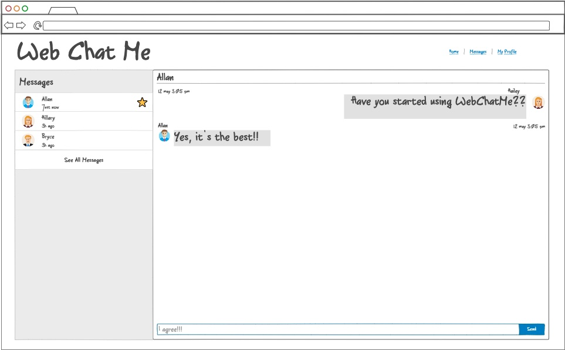

# startup
My startup application designed in CS 260.

Course notes found in [here](/notes.md).

# Web Chat Me

## Description Deliverable

### Elevator Pitch

Messaging today seems easy. Technology is advancing rapidly– we send quick texts to loved ones in seconds. However, even with the easy access, we still run into problems. iPhone users get annoyed with green texts, and Android users get annoyed with iPhone users. Computers can link to phones but it's not as simple and easy as people would like. Web Chat Me is here to build unity in the instant message space. You can message all of the important people in your life from one platform that's identical across all devices. Easily connect with others without any drama. No more bias, no more bickering, lots more benefits. Log in today!

### Design

### Key Features

 - Secure login over HTTPS
 - Ability to send messages to other users
 - Display of messages
 - Sidebar displaying all conversations
 - Ability to set profile picture to be seen by other users
 - Messages and data are safely stored

### Technologies

I am going to use the required technologies in the following ways:

 - **HTML** - Uses correct HTML structure for application. Three HTML pages, for login, messages, and profile page.
 - **CSS** - Application styling properly adjusts to different screen sizes. Application uses good whitespace, color choice and contrast.
 - **JavaScript** - Provides login, sending messages, displaying other users' messages, and backend endpoint calls.
 - **Service** - Backend service with endpoints for:
    - Login
    - Retrieving messages
    - Sending messages
 - **DB** - Stores users, messages, and profile data.
 - **Login** - Register and login users. Credentials stored securely in database. Can't send or receive messages unless authenticated.
 - **WebSocket** - As a user sends a message, the other user receives the message.
 - **React** - Application ported to use the React framework.

## HTML Deliverable

## CSS Deliverable

## JavaScript Deliverable

## Service Deliverable

## Database Deliverable

## Login Deliverable

## Websocket Deliverable

## React Deliverable
